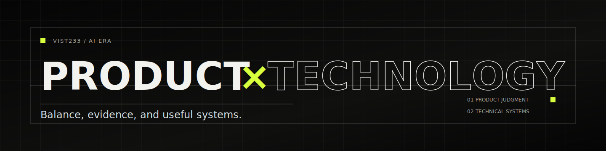

  

  <a href="https://zhangyvjing.com/">Home</a>
  ·
  <a href="https://zhangyvjing.com/blog/">Blog</a>
  ·
  <a href="https://zhangyvjing.com/blog/rss.xml">RSS</a>
  ·
  <a href="mailto:zhangyvjing@outlook.com">Contact</a>

## Vist233

I work on the balance between product judgment and technical systems in the AI era.

Public work:

- [AI-Web-Searcher](https://github.com/Vist233/AI-Web-Searcher) — search infrastructure for agent workflows.
- [Sakuragent](https://github.com/Vist233/Sakuragent) — agent runtime experiments around tools, memory, and structured output.
- [infinity_Agents](https://github.com/Vist233/infinity_Agents) — applied AI workflow experiments for research work.

Writing and design notes live at [zhangyvjing.com/blog](https://zhangyvjing.com/blog/).

Social: [Zhihu](https://www.zhihu.com/people/vist-18) · [X](https://x.com/zhangyvjing233)
